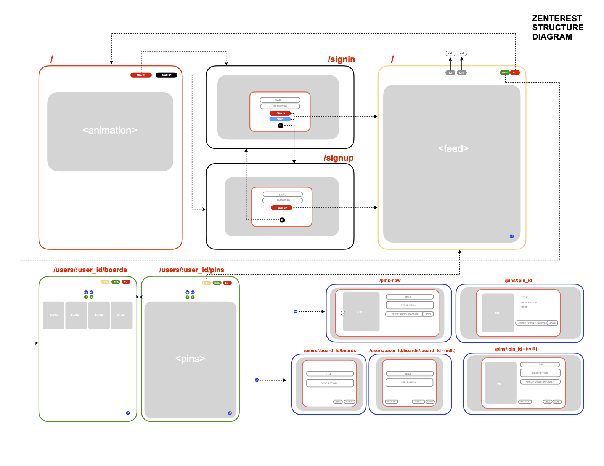

# Zenterest
Find your inspiration without the stress. Introducing Zenterest, a Pinterest inspired web application that allows users to create and share calming content through personalized user zen boards.

### Live Site:
* [Zenterest](http://zenterest-app.herokuapp.com/#/)

### Zenterest Wiki:
* [Zenterest Design Documents](https://github.com/colewendling/zenterest/wiki)

### MVP List:
* [MVP List](https://github.com/colewendling/zenterest/wiki/MVP-List)

### Sample State:
* [Sample State](https://github.com/colewendling/zenterest/wiki/Sample-State)

### Database Schema:
* [Database Schema](https://github.com/colewendling/zenterest/wiki/Database-Schema)

### Frontend Routes & Components:
* [Frontend Routes & Components](https://github.com/colewendling/zenterest/wiki/Frontend-Routes-&-Components)

### Backend Routes:
* [Backend Routes](https://github.com/colewendling/zenterest/wiki/Backend-Routes)

### Zenterest Diagram:

