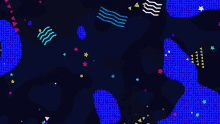

# Zenterest
Find your inspiration without the stress. Introducing Zenterest, a Pinterest inspired web application that allows users to create and share calming content through personalized user zen boards.

### Zenterest Wiki:
* [Zenterest Design Documents](https://github.com/colewendling/zenterest/wiki)

### MVP List:
* [MVP List](https://github.com/colewendling/zenterest/wiki/MVP-List)

### Sample State:
* [Sample State](https://github.com/colewendling/zenterest/wiki/Sample-State)

### Schema:
* [Schema](https://github.com/colewendling/zenterest/wiki/Schema)
